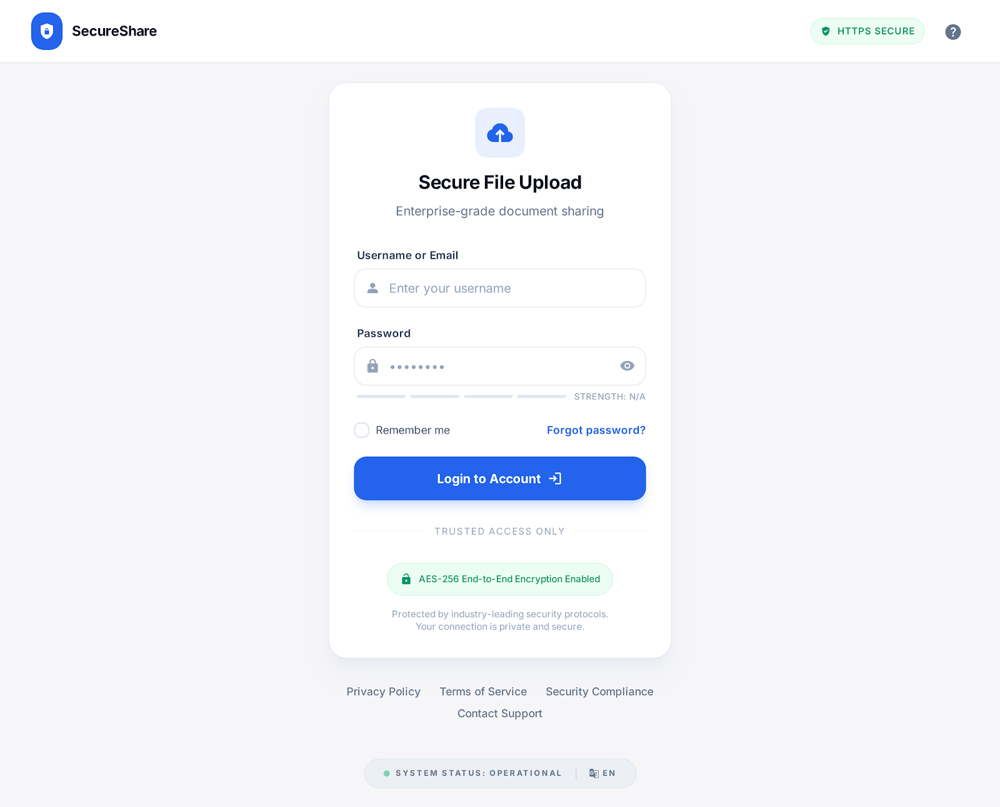
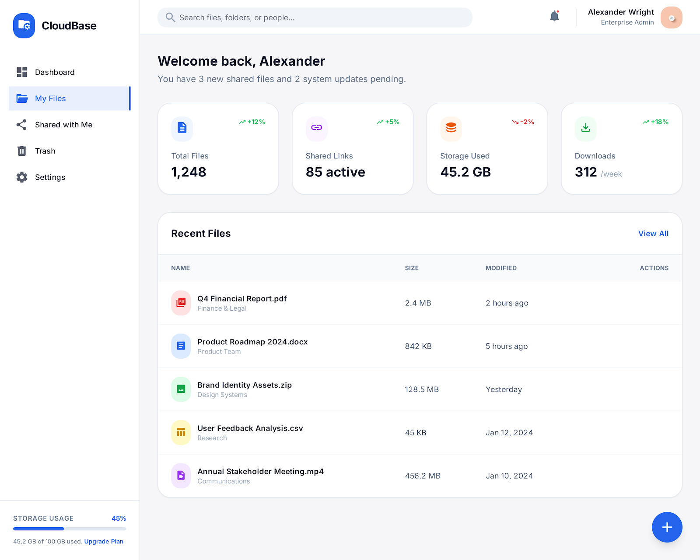
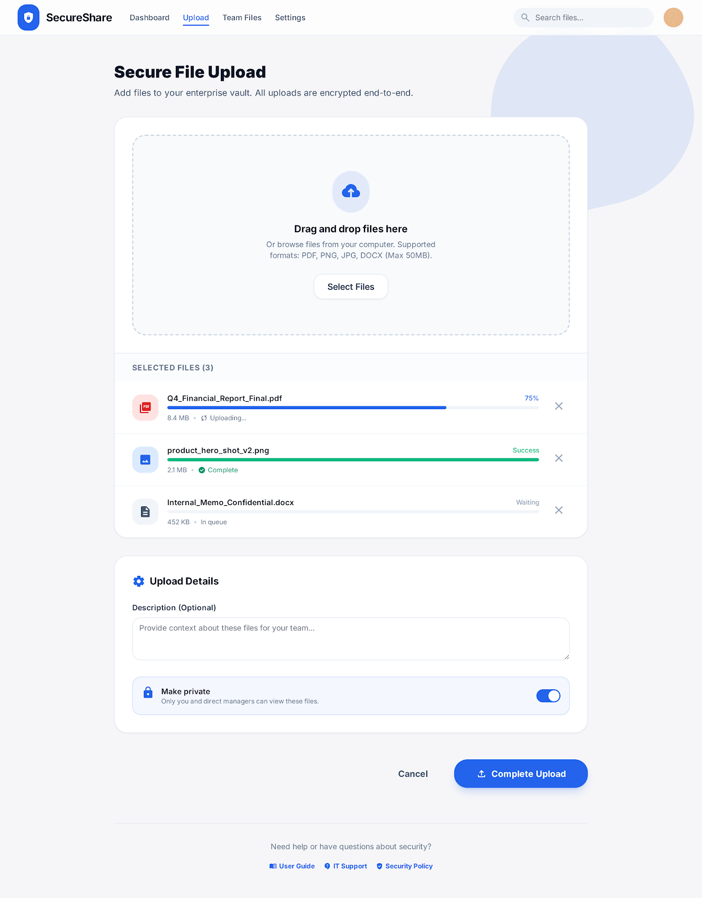
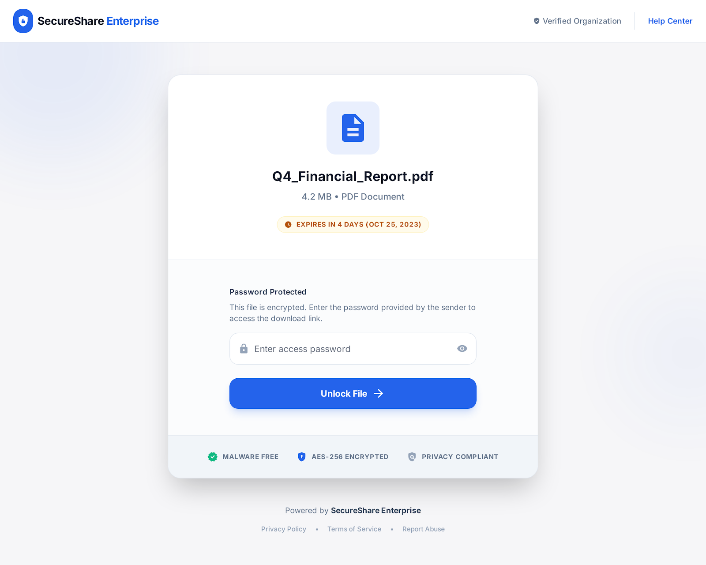

# 🔐 Secure File Upload and Sharing System


A robust web-based file management system built with **Java Servlets, JSP, and MySQL** that addresses critical security vulnerabilities in file sharing applications. Features multi-layered security including authentication, file validation, CSRF protection, and controlled access sharing.

---

## 📋 Table of Contents

- [Overview](#overview)
- [Features](#features)
- [Tech Stack](#tech-stack)
- [Security Implementation](#security-implementation)
- [Project Structure](#project-structure)
- [Installation](#installation)
- [Configuration](#configuration)
- [Usage](#usage)
- [Screenshots](#screenshots)
- [Database Schema](#database-schema)
- [API Endpoints](#api-endpoints)
- [Security Features](#security-features)
- [Testing](#testing)
- [Contributing](#contributing)
- [License](#license)
- [Contact](#contact)

---

## 🎯 Overview

The **Secure File Upload and Sharing System** solves the problem of **unsafe data sharing** by implementing enterprise-grade security measures. Unlike basic file upload systems, this application prevents common vulnerabilities such as:

- Malicious file uploads (`.exe`, `.jsp`, `.php`)
- Path traversal attacks (`../../etc/passwd`)
- SQL Injection and XSS attacks
- Unauthorized file access
- Session hijacking
- CSRF attacks

**Perfect for**: Students learning web security, developers building secure file management systems, or organizations needing a self-hosted secure file sharing solution.

---

## ✨ Features

### 🔐 User Management
- ✅ User registration with email validation
- ✅ Secure login with BCrypt password hashing (12 rounds)
- ✅ Session-based authentication with auto-timeout (30 min)
- ✅ Session fixation prevention (ID regeneration)
- ✅ Role-based access control (User/Admin)
- ✅ Password strength validation

### 📤 Secure File Upload
- ✅ **Whitelist-based file type validation** (PDF, DOC, DOCX, JPG, PNG, GIF, TXT, ZIP)
- ✅ **MIME type verification** (validates actual content, not just extension)
- ✅ **File size restrictions** (configurable, default 50MB)
- ✅ **Filename sanitization** (removes dangerous characters)
- ✅ **UUID-based unique naming** (prevents overwrites)
- ✅ **Storage outside web root** (accessible only via servlet)
- ✅ Metadata tracking (upload date, size, owner, description)

### 📁 File Management
- ✅ Personal dashboard with file listing
- ✅ Search and filter files
- ✅ Download own files securely
- ✅ Delete files with confirmation
- ✅ File preview for images/PDFs
- ✅ Storage quota tracking

### 🔗 Controlled File Sharing
- ✅ **Token-based shareable links** (random UUID tokens)
- ✅ **Access control options**:
  - View-only or download permission
  - Password protection
  - Expiration date/time
  - Download limit (max number of downloads)
- ✅ **Revoke access** anytime
- ✅ **Access logging** (IP, timestamp, action)

### 🛡️ Security Features
- ✅ CSRF token protection on all forms
- ✅ XSS prevention (input sanitization, output encoding)
- ✅ SQL injection prevention (PreparedStatements)
- ✅ HTTPOnly and Secure session cookies
- ✅ Authentication filter on protected resources
- ✅ Authorization checks for file access
- ✅ Comprehensive input validation

---

## 🛠️ Tech Stack

| Layer | Technology | Version |
|-------|-----------|---------|
| **Language** | Java | 17 (LTS) |
| **Frontend** | JSP, HTML5, CSS3, JavaScript | - |
| **Backend** | Java Servlets, HttpSession | 4.0.1 |
| **Database** | MySQL | 8.0+ |
| **Server** | Apache Tomcat | 9.0+ |
| **Build Tool** | Maven | 3.9+ |
| **Password Hashing** | BCrypt | 0.10.2 |
| **File Upload** | Apache Commons FileUpload | 1.5 |
| **IDE** | IntelliJ IDEA | 2023+ |

---

## 🔒 Security Implementation

### Defense-in-Depth Approach

```
┌─────────────────────────────────────────┐
│   Layer 1: Client-Side Validation      │ ◄── First defense
├─────────────────────────────────────────┤
│   Layer 2: CSRF Token Verification     │ ◄── Request authenticity
├─────────────────────────────────────────┤
│   Layer 3: Session Authentication      │ ◄── User identity
├─────────────────────────────────────────┤
│   Layer 4: Input Validation            │ ◄── Data sanitization
├─────────────────────────────────────────┤
│   Layer 5: File Content Validation     │ ◄── MIME type check
├─────────────────────────────────────────┤
│   Layer 6: Authorization Check         │ ◄── Access control
├─────────────────────────────────────────┤
│   Layer 7: Secure File Storage         │ ◄── Outside webroot
└─────────────────────────────────────────┘
```

### Vulnerability Protection

| Vulnerability | Protection Method |
|--------------|------------------|
| **SQL Injection** | PreparedStatements, parameterized queries |
| **XSS** | HTML encoding, input sanitization |
| **CSRF** | Unique tokens per session, validation on POST |
| **Path Traversal** | Filename sanitization, remove `../` sequences |
| **Session Hijacking** | HTTPOnly cookies, timeout, regeneration |
| **Malicious Upload** | Extension whitelist, MIME validation, size limits |
| **Direct File Access** | Files stored outside webapp, servlet-only access |
| **Brute Force** | Rate limiting on login (configurable) |

---

## 📂 Project Structure

```
SecureFileUploadSystem/
├── pom.xml                                 # Maven configuration
├── README.md
├── LICENSE
├── .gitignore
│
├── src/
│   ├── main/
│   │   ├── java/com/securefileupload/
│   │   │   ├── controllers/               # Servlets
│   │   │   │   ├── LoginServlet.java
│   │   │   │   ├── RegisterServlet.java
│   │   │   │   ├── LogoutServlet.java
│   │   │   │   ├── FileUploadServlet.java
│   │   │   │   ├── FileDownloadServlet.java
│   │   │   │   ├── FileDeleteServlet.java
│   │   │   │   ├── ShareFileServlet.java
│   │   │   │   └── DashboardServlet.java
│   │   │   │
│   │   │   ├── dao/                       # Data Access Objects
│   │   │   │   ├── UserDAO.java
│   │   │   │   ├── FileDAO.java
│   │   │   │   └── ShareLinkDAO.java
│   │   │   │
│   │   │   ├── models/                    # POJOs
│   │   │   │   ├── User.java
│   │   │   │   ├── FileMetadata.java
│   │   │   │   └── ShareLink.java
│   │   │   │
│   │   │   ├── filters/                   # Security Filters
│   │   │   │   ├── AuthenticationFilter.java
│   │   │   │   └── CSRFFilter.java
│   │   │   │
│   │   │   └── utils/                     # Utilities
│   │   │       ├── DBConnection.java
│   │   │       ├── SecurityUtil.java
│   │   │       ├── FileUtil.java
│   │   │       └── PasswordUtil.java
│   │   │
│   │   ├── resources/
│   │   │   └── db.properties              # Database config
│   │   │
│   │   └── webapp/
│   │       ├── WEB-INF/
│   │       │   ├── web.xml                # Deployment descriptor
│   │       │   └── lib/
│   │       │
│   │       ├── views/                     # JSP Pages
│   │       │   ├── login.jsp
│   │       │   ├── register.jsp
│   │       │   ├── dashboard.jsp
│   │       │   ├── upload.jsp
│   │       │   ├── share.jsp
│   │       │   └── error.jsp
│   │       │
│   │       ├── css/
│   │       │   └── style.css
│   │       │
│   │       ├── js/
│   │       │   └── script.js
│   │       │
│   │       └── index.jsp                  # Landing page
│   │
│   └── test/
│       └── java/                          # JUnit tests
│
├── database/
│   ├── schema.sql                         # Database schema
│   └── sample-data.sql                    # Sample data
│
└── docs/
    ├── setup-guide.md
    ├── security-analysis.md
    └── user-manual.md
```

---

## 🚀 Installation

### Prerequisites

- **Java Development Kit (JDK)**: 17 or higher
- **Apache Maven**: 3.8+
- **MySQL**: 8.0+
- **Apache Tomcat**: 9.0+
- **IntelliJ IDEA** (recommended) or any Java IDE

### Step 1: Clone Repository

```bash
git clone https://github.com/yourusername/secure-file-upload-system.git
cd secure-file-upload-system
```

### Step 2: Database Setup

```bash
# Login to MySQL
mysql -u root -p

# Create database and tables
source database/schema.sql

# (Optional) Load sample data
source database/sample-data.sql
```

Or manually create the database:

```sql
CREATE DATABASE secure_file_upload;
USE secure_file_upload;

-- Run the SQL from database/schema.sql
```

### Step 3: Configure Database Connection

Edit `src/main/java/com/securefileupload/utils/DBConnection.java`:

```java
private static final String DB_URL = "jdbc:mysql://localhost:3306/secure_file_upload";
private static final String DB_USER = "root";
private static final String DB_PASSWORD = "your_password_here";
```

### Step 4: Create Upload Directory

```bash
# Create directory outside webapp (Linux/Mac)
mkdir -p /secure-storage/uploads

# Windows (use absolute path in code)
# C:\secure-storage\uploads
```

Update file path in `FileUploadServlet.java`:

```java
private static final String UPLOAD_DIR = "/secure-storage/uploads";
// or for Windows: "C:\\secure-storage\\uploads"
```

### Step 5: Build Project

```bash
# Clean and install dependencies
mvn clean install

# Skip tests (if needed)
mvn clean install -DskipTests
```

### Step 6: Deploy to Tomcat

#### Using IntelliJ IDEA:
1. **Run → Edit Configurations**
2. **Add Tomcat Server → Local**
3. **Configure Tomcat installation path**
4. **Deployment tab → Add Artifact → WAR exploded**
5. **Application context**: `/` or `/secure-file-upload`
6. **Click Run**

#### Using Maven:
```bash
mvn tomcat7:run
```

#### Manual Deployment:
```bash
# Copy WAR to Tomcat
cp target/SecureFileUpload.war /path/to/tomcat/webapps/

# Start Tomcat
cd /path/to/tomcat/bin
./startup.sh        # Linux/Mac
startup.bat         # Windows
```

### Step 7: Access Application

```
http://localhost:8080/
```

**Default Test Account** (if you loaded sample data):
- Username: `testuser`
- Password: `Test@123`

---

## ⚙️ Configuration

### File Upload Settings

Edit `FileUploadServlet.java`:

```java
// Maximum file size (50MB)
private static final long MAX_FILE_SIZE = 50 * 1024 * 1024;

// Allowed file extensions
private static final List<String> ALLOWED_EXTENSIONS = Arrays.asList(
    "pdf", "doc", "docx", "jpg", "jpeg", "png", "gif", "txt", "zip"
);

// Upload directory
private static final String UPLOAD_DIR = "/secure-storage/uploads";
```

### Session Timeout

Edit `web.xml`:

```xml
<session-config>
    <session-timeout>30</session-timeout>  <!-- 30 minutes -->
</session-config>
```

### Database Connection Pool (Advanced)

For production, use connection pooling (Apache DBCP or HikariCP):

```xml
<!-- Add to pom.xml -->
<dependency>
    <groupId>com.zaxxer</groupId>
    <artifactId>HikariCP</artifactId>
    <version>5.0.1</version>
</dependency>
```

---

## 📖 Usage

### 1. User Registration

1. Navigate to registration page
2. Enter username, email, password
3. Password must meet requirements:
   - Minimum 8 characters
   - At least 1 uppercase letter
   - At least 1 lowercase letter
   - At least 1 number
   - At least 1 special character
4. Click **Register**

### 2. Upload Files

1. Login to your account
2. Navigate to **Upload** page
3. Select file (max 50MB)
4. Add optional description
5. Click **Upload**
6. File appears in dashboard

### 3. Share Files

1. Go to **Dashboard**
2. Click **Share** on any file
3. Configure sharing options:
   - Set expiration date (optional)
   - Add password protection (optional)
   - Set download limit (optional)
4. Click **Generate Link**
5. Copy and share the unique URL

### 4. Access Shared Files

1. Open shared link in browser
2. Enter password (if required)
3. View or download file
4. Link expires based on settings

---

## 📸 Screenshots

### Login Page


### Dashboard


### File Upload


### Share Settings


---

## 🗄️ Database Schema

### Entity Relationship Diagram

```
┌─────────────┐
│    users    │
├─────────────┤
│ user_id (PK)│───┐
│ username    │   │
│ email       │   │
│ password_hash│  │
│ role        │   │
│ created_at  │   │
└─────────────┘   │
                  │
                  │ 1:N
                  │
┌─────────────┐   │
│    files    │◄──┘
├─────────────┤
│ file_id (PK)│───┐
│ user_id (FK)│   │
│ original_name│  │
│ stored_name │   │
│ file_path   │   │
│ file_size   │   │
│ upload_date │   │
└─────────────┘   │
                  │ 1:N
                  │
┌─────────────┐   │
│ share_links │◄──┘
├─────────────┤
│ share_id(PK)│───┐
│ file_id (FK)│   │
│ share_token │   │
│ created_by  │   │
│ expires_at  │   │
│ max_downloads│  │
└─────────────┘   │
                  │ 1:N
                  │
┌─────────────┐   │
│ access_logs │◄──┘
├─────────────┤
│ log_id (PK) │
│ share_id(FK)│
│ ip_address  │
│ access_time │
│ action      │
└─────────────┘
```

### Table Details

#### users
```sql
CREATE TABLE users (
    user_id INT AUTO_INCREMENT PRIMARY KEY,
    username VARCHAR(50) UNIQUE NOT NULL,
    email VARCHAR(100) UNIQUE NOT NULL,
    password_hash VARCHAR(255) NOT NULL,
    role ENUM('user', 'admin') DEFAULT 'user',
    created_at TIMESTAMP DEFAULT CURRENT_TIMESTAMP,
    is_active BOOLEAN DEFAULT TRUE
);
```

#### files
```sql
CREATE TABLE files (
    file_id INT AUTO_INCREMENT PRIMARY KEY,
    user_id INT NOT NULL,
    original_filename VARCHAR(255) NOT NULL,
    stored_filename VARCHAR(255) UNIQUE NOT NULL,
    file_path VARCHAR(500) NOT NULL,
    file_size BIGINT NOT NULL,
    file_type VARCHAR(50) NOT NULL,
    description TEXT,
    upload_date TIMESTAMP DEFAULT CURRENT_TIMESTAMP,
    FOREIGN KEY (user_id) REFERENCES users(user_id) ON DELETE CASCADE
);
```

#### share_links
```sql
CREATE TABLE share_links (
    share_id INT AUTO_INCREMENT PRIMARY KEY,
    file_id INT NOT NULL,
    share_token VARCHAR(255) UNIQUE NOT NULL,
    created_by INT NOT NULL,
    password_hash VARCHAR(255),
    expires_at TIMESTAMP,
    max_downloads INT,
    download_count INT DEFAULT 0,
    is_active BOOLEAN DEFAULT TRUE,
    created_at TIMESTAMP DEFAULT CURRENT_TIMESTAMP,
    FOREIGN KEY (file_id) REFERENCES files(file_id) ON DELETE CASCADE,
    FOREIGN KEY (created_by) REFERENCES users(user_id) ON DELETE CASCADE
);
```

#### access_logs
```sql
CREATE TABLE access_logs (
    log_id INT AUTO_INCREMENT PRIMARY KEY,
    share_id INT NOT NULL,
    ip_address VARCHAR(50),
    access_time TIMESTAMP DEFAULT CURRENT_TIMESTAMP,
    action ENUM('view', 'download') NOT NULL,
    FOREIGN KEY (share_id) REFERENCES share_links(share_id) ON DELETE CASCADE
);
```

---

## 🔌 API Endpoints

### Authentication

| Method | Endpoint | Description | Auth Required |
|--------|----------|-------------|---------------|
| POST | `/register` | User registration | No |
| POST | `/login` | User login | No |
| GET | `/logout` | User logout | Yes |

### File Management

| Method | Endpoint | Description | Auth Required |
|--------|----------|-------------|---------------|
| GET | `/dashboard` | View user files | Yes |
| POST | `/uploadFile` | Upload new file | Yes |
| GET | `/downloadFile?id={fileId}` | Download file | Yes |
| POST | `/deleteFile` | Delete file | Yes |

### File Sharing

| Method | Endpoint | Description | Auth Required |
|--------|----------|-------------|---------------|
| POST | `/shareFile` | Generate share link | Yes |
| GET | `/share/{token}` | Access shared file | No |
| POST | `/revokeShare` | Revoke share link | Yes |

---

## 🛡️ Security Features

### Authentication & Session

```java
// Password Hashing (BCrypt with 12 rounds)
String hashedPassword = BCrypt.hashpw(plainPassword, BCrypt.gensalt(12));

// Session Creation
HttpSession session = request.getSession(true);
session.setAttribute("userId", user.getId());
session.setMaxInactiveInterval(1800); // 30 minutes

// Session Fixation Prevention
request.changeSessionId();

// Session Cookie Configuration
<cookie-config>
    <http-only>true</http-only>
    <secure>false</secure> <!-- true for HTTPS -->
</cookie-config>
```

### CSRF Protection

```java
// Generate token (on page load)
String csrfToken = UUID.randomUUID().toString();
session.setAttribute("csrfToken", csrfToken);

// Validate token (on form submit)
String sessionToken = (String) session.getAttribute("csrfToken");
String requestToken = request.getParameter("csrfToken");

if (!sessionToken.equals(requestToken)) {
    throw new SecurityException("Invalid CSRF token");
}
```

### Input Sanitization

```java
// XSS Prevention
public static String sanitizeInput(String input) {
    return input.replace("<", "&lt;")
               .replace(">", "&gt;")
               .replace("\"", "&quot;")
               .replace("'", "&#x27;")
               .replace("&", "&amp;");
}

// Filename Sanitization
public static String sanitizeFilename(String filename) {
    filename = new File(filename).getName();
    filename = filename.replaceAll("[^a-zA-Z0-9._-]", "_");
    filename = filename.replaceAll("\\.{2,}", ".");
    return filename;
}
```

### File Validation

```java
// Extension Whitelist
private static final List<String> ALLOWED_EXTENSIONS = 
    Arrays.asList("pdf", "doc", "docx", "jpg", "png");

// MIME Type Validation
String contentType = filePart.getContentType();
if (!ALLOWED_MIME_TYPES.contains(contentType)) {
    throw new SecurityException("Invalid file type");
}

// Size Validation
if (fileSize > MAX_FILE_SIZE) {
    throw new SecurityException("File too large");
}
```

---

## 🧪 Testing

### Manual Testing Checklist

#### Security Tests
- [ ] Try uploading `.exe`, `.jsp`, `.php` files (should be blocked)
- [ ] Rename `malicious.exe` to `malicious.jpg` (should be blocked by MIME check)
- [ ] Try SQL injection in login: `' OR '1'='1`
- [ ] Try XSS in file description: `<script>alert('XSS')</script>`
- [ ] Access other user's files directly via URL
- [ ] Submit form without CSRF token
- [ ] Try path traversal: `../../etc/passwd`
- [ ] Upload file > 50MB

#### Functional Tests
- [ ] User registration with valid data
- [ ] Login with correct credentials
- [ ] Upload allowed file types
- [ ] Download own files
- [ ] Share file with password
- [ ] Access shared file with token
- [ ] Revoke share link
- [ ] Session timeout after 30 minutes
- [ ] Delete file

### Unit Tests (Optional)

```bash
# Run all tests
mvn test

# Run specific test class
mvn test -Dtest=SecurityUtilTest
```

---

## 🤝 Contributing

Contributions are welcome! Please follow these guidelines:

### How to Contribute

1. **Fork the repository**
2. **Create feature branch**: `git checkout -b feature/amazing-feature`
3. **Commit changes**: `git commit -m 'Add amazing feature'`
4. **Push to branch**: `git push origin feature/amazing-feature`
5. **Open Pull Request**

### Coding Standards

- Follow Java naming conventions
- Add JavaDoc comments for public methods
- Write unit tests for new features
- Ensure no security vulnerabilities
- Update README if needed

### Areas for Contribution

- [ ] Two-factor authentication (2FA)
- [ ] Email notifications for shared files
- [ ] File versioning system
- [ ] Advanced search with filters
- [ ] REST API endpoints
- [ ] File preview for more types
- [ ] Virus scanning integration (ClamAV)
- [ ] Docker containerization
- [ ] Cloud storage integration (AWS S3)

---

## 📄 License

This project is licensed under the **MIT License** - see the [LICENSE](LICENSE) file for details.

```
MIT License

Copyright (c) 2024 Monish R

Permission is hereby granted, free of charge, to any person obtaining a copy
of this software and associated documentation files (the "Software"), to deal
in the Software without restriction, including without limitation the rights
to use, copy, modify, merge, publish, distribute, sublicense, and/or sell
copies of the Software, and to permit persons to whom the Software is
furnished to do so, subject to the following conditions:

The above copyright notice and this permission notice shall be included in all
copies or substantial portions of the Software.

THE SOFTWARE IS PROVIDED "AS IS", WITHOUT WARRANTY OF ANY KIND, EXPRESS OR
IMPLIED, INCLUDING BUT NOT LIMITED TO THE WARRANTIES OF MERCHANTABILITY,
FITNESS FOR A PARTICULAR PURPOSE AND NONINFRINGEMENT. IN NO EVENT SHALL THE
AUTHORS OR COPYRIGHT HOLDERS BE LIABLE FOR ANY CLAIM, DAMAGES OR OTHER
LIABILITY, WHETHER IN AN ACTION OF CONTRACT, TORT OR OTHERWISE, ARISING FROM,
OUT OF OR IN CONNECTION WITH THE SOFTWARE OR THE USE OR OTHER DEALINGS IN THE
SOFTWARE.
```

---

## 📞 Contact

**Your Name**
- GitHub: [@monishdoss](https://github.com/MonishDoss)
- Email: monishdoss2005@gmail.com
- LinkedIn: [மோனீஷ்தாஸ்]https://www.linkedin.com/in/monishdoss)

**Project Link**: [https://github.com/MonishDoss/Secure-File-Upload-and-Sharing-System.git](https://github.com/MonishDoss/Secure-File-Upload-and-Sharing-System.git)

---

## 🙏 Acknowledgments

- [Apache Commons FileUpload](https://commons.apache.org/proper/commons-fileupload/)
- [BCrypt for Java](https://github.com/patrickfav/bcrypt)
- [OWASP Security Guidelines](https://owasp.org/)
- [MySQL Documentation](https://dev.mysql.com/doc/)
- [Apache Tomcat](https://tomcat.apache.org/)

---

## 📚 Additional Resources

- [OWASP Top 10 Web Application Security Risks](https://owasp.org/www-project-top-ten/)
- [Java Servlet Specification](https://javaee.github.io/servlet-spec/)
- [MySQL Security Best Practices](https://dev.mysql.com/doc/refman/8.0/en/security.html)
- [BCrypt Password Hashing](https://en.wikipedia.org/wiki/Bcrypt)

---

## 📈 Project Stats


---

<p align="center">
  Made with ❤️ for secure file sharing
</p>

<p align="center">
  <sub>If you found this project helpful, please consider giving it a ⭐</sub>
</p>
